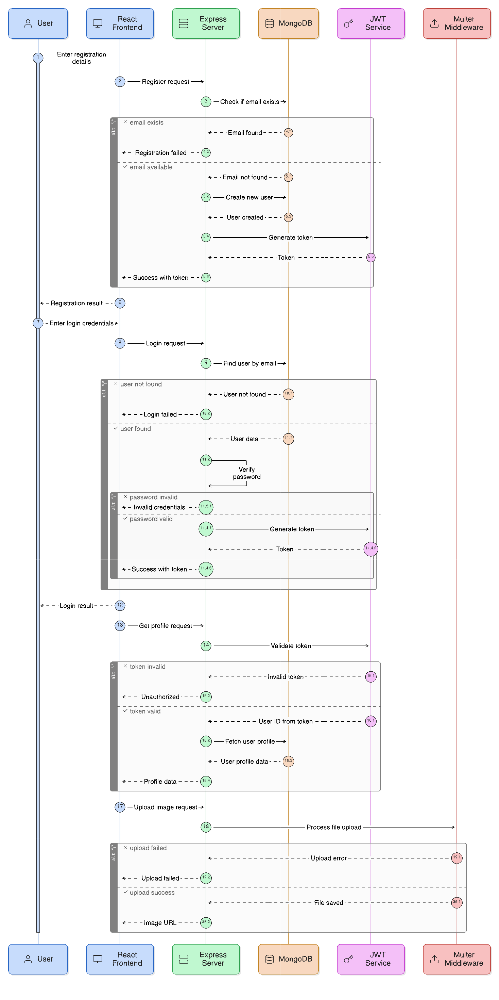

# Behavioral Logic – Sequence Diagrams

The following UML Sequence Diagrams illustrate the dynamic interaction between system components for key use cases in PrepZilla.AI.

---

## 1️⃣ Authentication Module

This diagram demonstrates the authentication workflow including:

- User Registration
- User Login
- JWT Token Generation
- Profile Fetch (Protected Route)
- Profile Image Upload

  

---

## 2️⃣ Session Management Module

This diagram shows how interview sessions are created, retrieved, and deleted.

Includes:

- Create Session
- Get My Sessions
- Delete Session
- JWT Middleware validation
- MongoDB interactions

  

---

## 3️⃣ Question Management Module

This diagram illustrates how questions are managed inside a session.

Includes:

- Add Questions
- Toggle Pin
- Update Notes
- Database update operations

  

---

## 4️⃣ AI Interaction Module

This diagram represents the AI-powered interview generation flow.

Includes:

- Generate Interview Questions
- Generate Concept Explanation
- JWT Authentication
- Google Gemini API Integration
- JSON parsing and response handling

  

---

### Architecture Note

The system follows a modular sequence interaction pattern:

- React communicates with Express via REST APIs.
- Protected routes pass through JWT Middleware.
- Controllers directly interact with MongoDB.
- AI-related requests communicate with Google Gemini API.
- File uploads are handled using Multer middleware.
