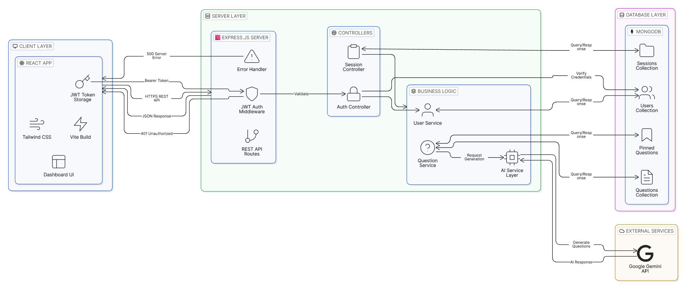

### Architecture Overview

The system follows a 3-tier architecture:
- React frontend communicates with Express backend via HTTPS REST APIs.
- JWT middleware handles authentication.
- MongoDB manages persistent data.
- Google Gemini API is used for AI-powered question generation.

## System Architecture

  

